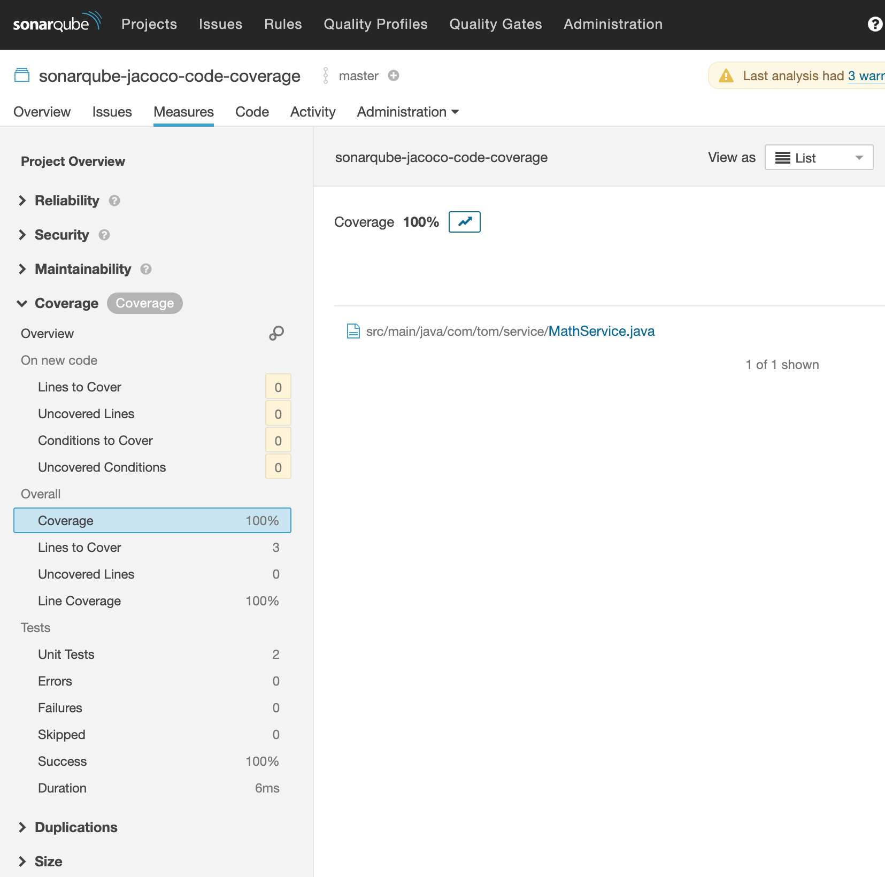

# Test code coverage example

> _Based on: [https://tomgregory.com/how-to-measure-code-coverage-using-sonarqube-and-jacoco](https://tomgregory.com/how-to-measure-code-coverage-using-sonarqube-and-jacoco)_

## TL;DR

* Sonar running locally with docker-compose

* Simple java class (MathService) with two methods to test: "multiply and "subtract"

* Run tests succesfully. Jacoco plugin generates a binary for Sonarqube.

* Open Sonarqube (http://localhost:9000), user/pass: admin/admin.

* Initially, test coverage is 66%. Class itself and multiply but no subtract (2 of 3).

* Finally, adding a simple subtract test case fulfills 100% test coverage.

---

---

## Original readme

Repository to go along with the *How To Test Code Coverage Using SonarQube and Jacoco* 
[YouTube video](https://youtu.be/6BTOd0X8UCs) and article at [tomgregory.com](https://tomgregory.com/how-to-measure-code-coverage-using-sonarqube-and-jacoco/).

## Pre-requisites

* JDK 8+
* Docker

## Running

#### Running SonarQube

`./gradlew dockerComposeUp`

This will run SonarQube at [locahost:9000](http://localhost:9000).

#### Running a SonarQube scan

Wait for SonarQube to start, then run:

`./gradlew sonarqube`

## Stopping

`./gradlew dockerComposeDown`

## SonarQube 7 vs. 8

This example runs against the *lts* version of SonarQube (currently SonarQube 7).
An example using SonarQube 8 can be found on the [sonarqube-8](https://github.com/tkgregory/sonarqube-jacoco-code-coverage/tree/sonarqube-8) branch.